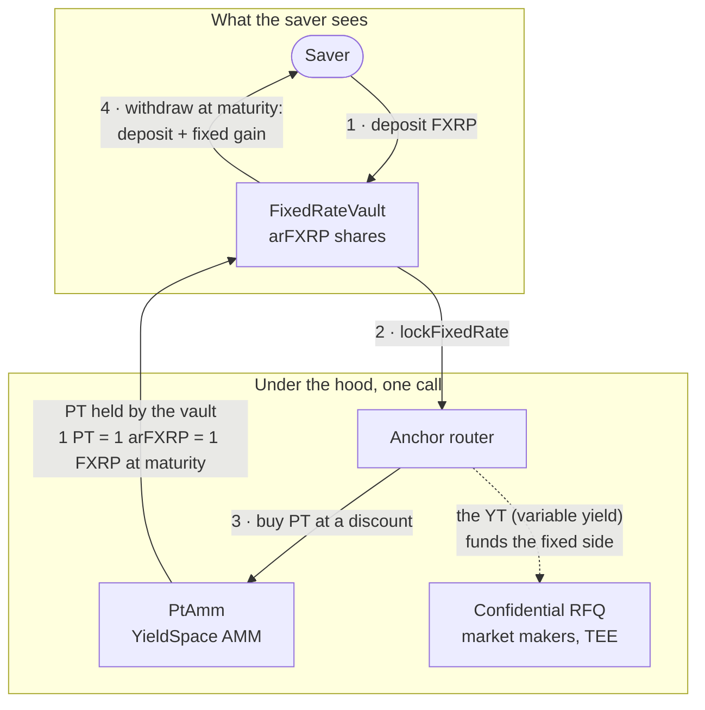

# Agama · fixed-rate FXRP on Flare

**Lock a fixed rate on your XRP. Sell the uncertainty.**

Agama brings fixed-rate savings to XRPFi on [Flare](https://flare.network). You
deposit FXRP, buy the **principal token (PT)** at a discount, and redeem it **1:1 at maturity**.
Your return is fixed the moment you buy, no matter what the underlying vault actually earns. The
variable yield goes to whoever wants the upside (the **yield token, YT**).

Built for the Flare Summer Signal hackathon. Live on Coston2.

## Why

XRPFi is yield poor and yield variable: today's vaults pay a few percent that nobody can promise
in advance. Agama turns that variable stream into a choice. Buy PT to lock certainty, or buy YT
to take the upside. Same deposit, two honest sides of the same trade.

## The saver's view (one pool, no jargon)

Most people do not want to think about PT, YT, or an AMM. `FixedRateVault` is a standard
**ERC-4626 pool** (shares: `arFXRP`, built on OpenZeppelin) that hides all of it: **deposit FXRP,
see the exact amount you will have at maturity, withdraw more at maturity.** One deposit, one rate,
one withdrawal. The vault routes the deposit through the machinery below in a single call, so the
saver only ever sees a single fixed-rate pool and an `arFXRP` balance in their wallet.



Two properties make it honest, and both are tested:

- **The rate is locked at entry.** Shares are *par-denominated*: 1 `arFXRP` redeems 1:1 for FXRP at
  maturity, so a 100 FXRP deposit that locks 1.5% mints 101.5 `arFXRP`, and **no later deposit can
  re-price it** (deliberately not a blended rising-NAV pool that would average everyone's rate).
- **Donation-proof.** Shares are minted from the AMM's realized fill, not a `totalAssets/supply`
  ratio, and `totalAssets == totalSupply`, so the classic ERC-4626 donation / inflation attack is a
  no-op by construction: no donation can change what a deposit mints or a redemption pays.

Proven live on Coston2: a real `deposit(100 FXRP)` minted `101.49 arFXRP`, with
`totalSupply == totalAssets == PT held` on chain.

## How it works (under the hood)

The saver only sees the pool above. Underneath, four steps manufacture and lock the rate:

1. **Deposit into a vault.** FXRP earns real XRPFi yield in an ERC-4626 vault (e.g. Mystic Core
   FXRP or Bizantine SuperVault), issued as vault shares.
2. **Split into PT + YT.** The position is tokenized: principal and yield become two separate,
   tradable tokens. PT redeems 1:1 for principal at maturity; YT captures all the yield until then.
3. **Buy PT at a discount.** On a real YieldSpace AMM you buy PT below par. That discount *is*
   your fixed rate, locked at purchase.
4. **Redeem 1:1 at maturity.** Each PT redeems for exactly 1 FXRP of principal. Your return was
   fixed on day one, whatever the yield did.

The fixed rate is manufactured by the PT discount, not by anyone's balance sheet. As maturity
nears, the YieldSpace curve flattens to constant-sum and PT converges to par mechanically.

## Architecture

| Contract | Role |
| --- | --- |
| `YieldSplitter.sol` | The PT/YT engine over an ERC-4626 vault. Split, claim yield, redeem principal. MasterChef-style yield accounting stays correct when YT changes hands. |
| `SplitToken.sol` | Minimal ERC20 for PT and YT. The YT instance settles yield on every transfer. |
| `PtAmm.sol` | A real YieldSpace AMM (`x^(1-t) + y^(1-t) = k`) for PT vs FXRP, decimals-aware (real FXRP is 6 decimals), PRBMath fixed point. Buying PT locks a fixed rate. |
| `Anchor.sol` | The user-facing router. One call to lock a fixed rate, a quote for the front, and 1:1 redemption at maturity. |
| `FixedRateVault.sol` | The **saver-facing ERC-4626 pool** (OpenZeppelin, shares `arFXRP`). `deposit(FXRP)` routes through Anchor to buy PT and mints par-denominated shares (1 share = 1 FXRP at maturity); `redeem` at maturity routes PT back to FXRP. Term-locked via the standard `max*` guards. Shares come from the AMM fill and `totalAssets == totalSupply`, so the ERC-4626 donation/inflation attack is a no-op. Hides PT/YT entirely from the saver. |
| `ConfidentialYtRfq.sol` | The confidential YT demand side. Market makers quote privately inside a TEE; the enclave signs only the winning settlement, which this contract verifies (against the attestation-gated key) and executes. |
| `tee/ConfidentialSpaceRegistry.sol` + `rsa/RsaVerify.sol` | Attestation-gated enclave key, following the real GCP Confidential Space flow. Verifies a Confidential Space attestation **JWT** on chain: RS256 (via the modexp precompile) against Google's signer key, then reads each claim at its **exact JSON path** (`tee/JsonLite.sol`, not a substring scan, so operator-controlled `env`/label keys cannot spoof a claim) and requires a non-debuggable production Intel TDX enclave running the approved image. Owner-gated, one-time per token, and expiry-checked. `EnclaveRegistry.sol` is a simpler RS256-over-a-statement variant. |
| `FtsoReader.sol` | Reads the enshrined FTSOv2 oracle to denominate FXRP positions in USD (front and enclave). |
| `XrpOnRamp.sol` + `fdc/IFdc.sol` | Native-XRP on-ramp: verifies an FDC Payment proof against the enshrined FdcVerification, so real XRP from the XRPL is credited on Flare with no bridge trust. |
| `interfaces/IERC4626.sol` | The standard vault surface the splitter codes against, so a real vault is a one-line swap. |
| `MockERC20.sol`, `MockVault.sol` | Test and demo stand-ins for FXRP and a yield-bearing vault. |

## Flare integration (the whole enshrined stack)

Agama uses five of Flare's enshrined protocols, each doing real work, not a superficial call:

| Protocol | How Agama uses it |
| --- | --- |
| **FAssets (FXRP)** | The underlying asset. The product is fixed-rate savings on bridged XRP. |
| **Confidential Compute (TEE)** | The YT demand side runs as a confidential RFQ in a Confidential Space enclave: market makers quote privately, only the winning settlement is revealed. The enclave key is registered only via a real Confidential Space attestation **JWT** verified on chain that proves a **non-debuggable, production Intel TDX** enclave (`hwmodel GCP_INTEL_TDX`, `swname CONFIDENTIAL_SPACE`, `dbgstat disabled-since-boot`) running the approved code image. |
| **FTSO** | The enclave prices every quote's premium in USD via the live XRP/USD feed and **rejects any quote outside a USD band** (the accept/reject decision depends on the oracle, not just token units); the front denominates the fixed rate in USD. |
| **Secure RNG** | Breaks best-price ties between market makers fairly and verifiably in the confidential matcher. |
| **FDC** | Native-XRP on-ramp: an FDC Payment proof of an XRPL transfer is verified on chain (against the Relay Merkle root), and `XrpOnRamp.depositAndLock` then **releases FXRP and locks the fixed rate through Anchor in the same call** so no FXRP moves without a real proof. Proven end to end with a live XRPL payment and its attestation. |

## Proven

`forge test` runs **44 tests, all green**, including:

- The saver pool (`FixedRateVault`, OpenZeppelin ERC-4626): a deposit locks the rate at entry
  (par-denominated `arFXRP` shares), the outcome is independent of the realized yield, **two savers
  entering at different times each keep their own locked rate** (no blending), the ERC-4626
  donation/inflation attack changes neither mint nor redemption, and the term lock holds (deposits
  close at maturity, withdrawals open at maturity).
- The full lifecycle: split, YT captures the yield, PT redeems principal 1:1.
- Sell YT to lock certainty; the yield accounting splits correctly on transfer.
- The YieldSpace AMM: PT trades at a discount, implies a 5% fixed APR, converges to par at maturity.
- End to end: a buyer's realized return equals the rate locked at purchase, **independent of the
  realized yield**, which flows entirely to YT.
- The unified router exercised at both 18 and the real **6 decimals** (identical result).
- A **live Flare mainnet fork test** binding the splitter to the real `bizFXRP` ERC-4626 vault:
  real FXRP deposit, real price-per-share, position equals principal.
- The confidential YT RFQ: an enclave-signed best-execution settlement is verified and settled on
  chain; a forged signature is rejected; the seller can reclaim escrowed YT.
- Live reads of the enshrined **FTSO** (XRP/USD) and **Secure RNG** on a Coston2 fork.
- The **FDC** Payment-proof verification path wired to the live FdcVerification, rejecting an
  unattested proof.
- **Confidential Space attestation on chain**: a real-format CS attestation JWT is verified (RS256
  via modexp, base64url payload decode, issuer + `image_digest` + `eat_nonce` checks); tampered
  signatures, forged enclave keys, and unapproved code images are all rejected.
- **A real native-XRP round-trip**: a real XRPL testnet payment, attested by the FDC, is verified
  on chain against the live Relay Merkle root and credited by `XrpOnRamp` (replay-protected).

## Confidential Compute (Bounty 2)

Fixed-rate products need a two-sided market: for a buyer to lock certainty, someone must take the
variable yield (the YT). On a yield-poor chain that YT demand is thin, and market makers will not
post public quotes because an on-chain order book leaks their pricing.

`ConfidentialYtRfq` runs that demand side as a **confidential request-for-quote inside a Flare
Confidential Compute enclave (GCP Confidential Space, Intel TDX)**. Market makers submit sealed
quotes to the enclave; it runs best execution and signs **only the winning settlement**; the
contract verifies the enclave signature (registered on chain from its remote attestation) and
settles atomically. The losing quotes never touch the chain.

This makes the same product qualify for both hackathon tracks: an interoperable asset product
(Bounty 1) whose counterparty market is a private application built with Flare Confidential
Compute (Bounty 2).

**Attestation-gated trust, following the Confidential Space docs.** The contract does not trust a
manually set key. `ConfidentialSpaceRegistry` registers the enclave key only after verifying, on
chain, a real **GCP Confidential Space attestation JWT**: RS256 (`rsa/RsaVerify.sol` via the modexp
precompile) against Google's confidentialspace-sign key, then it base64url-decodes the token payload
and requires the issuer, the approved `image_digest`, the presented enclave key as the token
`eat_nonce`, and, crucially, that the enclave is a **non-debuggable production Intel TDX** one:
`hwmodel GCP_INTEL_TDX`, `swname CONFIDENTIAL_SPACE`, `dbgstat disabled-since-boot`. A debug enclave
(where the operator could read or forge the key) and a non-TDX platform are both rejected on chain
(two dedicated tests). `ConfidentialYtRfq` reads its trusted key from the registry.

**This runs live, not as scaffolding.** The enclave workload (`enclave/matcher.py`) runs continuously
inside a real **production GCP Confidential Space VM (Intel TDX)**: it generates its signing key inside the TEE
(nobody, including us, holds the private key), requests a real Google-signed attestation token binding
that key to its image digest, and serves `/attestation` and `/settle`. That real Google token is
verified on chain by `ConfidentialSpaceRegistry` (`test/ConfidentialSpaceGoogle.t.sol` replays it
against Google's JWKS modulus), registering the enclave key. A full settlement has been run end to
end on Coston2: sealed quotes to the live enclave, it signs the winner in the TEE, the contract
verifies that signature and settles (`enclave/e2e_onchain.py`).

**The matching endpoint is safe to expose.** Every quote must be signed by its market maker (the
enclave rejects any quote whose signature does not recover to the claimed MM, see `quoteDigest`), the
enclave reads the RFQ terms (seller, ytAmount, reserve) from chain rather than the caller, checks the
winning MM can actually pay, and the seller's reserve `minPrice` is enforced on-chain in `settle`. So
a caller can neither forge a quote for someone else nor win below the reserve. Requests are also
bounded (at most 32 quotes each, cheapest check first, and only the leading quotes are checked for
solvency) and globally rate-limited, so a caller cannot amplify work through the endpoint.
`enclave/e2e_onchain.py` exercises this live: a forged-for-another-MM quote rejected, a below-reserve
quote rejected, an oversized (33-quote) request rejected, and the best authentic quote signed by the
enclave and settled on chain.

**Live in the app.** The `/rfq` page in `web/` drives this end to end. "Request quotes" makes your
wallet the seller: it splits your FXRP into PT + YT and opens your own on-chain RFQ, then the deployed
backend (`web/app/api/tee-demo`) submits the market-maker bids to the live enclave, gets the winning
signature and relays the `settle` on chain. A per-step tracker shows every transaction, and the winning
premium lands in your wallet.

The deployed demo at **agama-fixed-rate.vercel.app/rfq** now settles over the Flare Compute Extension
in [`fce/`](fce/) — extension 66302 on GCP AMD SEV — rather than the on-chain-attested TDX variant:
each quote is posted sealed to the extension proxy, settlement is requested on chain, and `settle()`
checks the signer against Flare's machine registry. Verified live from the deployed site (settle tx
`0xa10842ea…`). The wider app at app.agama.finance/flare/rfq is a separate deployment and still runs
the TDX build.

### The same RFQ on Flare's own rails — [`fce/`](fce/)

The version above verifies the enclave attestation **on chain** (`ConfidentialSpaceRegistry`, Intel
TDX) — anyone can independently check that the signing key belongs to the approved image. [`fce/`](fce/)
is the same confidential RFQ rebuilt as a **Flare Compute Extension**: instead of a custom on-chain
registry, the TEE machine is registered with Flare's own `FlareTeeManager`, and the enclave runs in a
GCP Confidential Space VM on **AMD SEV**. It is deployed and settling on Coston2 — extension **66302**,
`AgamaRfqInstructionSender` `0x40d282d699698193eE7f0379039E1aa0ec7016b6`, machine
`0x11356db7…6bf29` at PRODUCTION — with the C-chain indexer self-hosted (no Flare-issued database
credentials) and a full round trip proven on chain (tx `0xc0dc1ab1…`). `settle` binds the accepted
signer to the machine registry (`getActiveTeeMachines`), so only a registry-active, attested machine
can settle — not merely an address the owner set.

The two are complementary, not duplicates. `fce/` gains **per-market-maker sealed submission** (each
MM's quote is sealed from the aggregator, not just from the chain) and moves the **FTSO USD price band
on chain**, so the settlement contract — not only the enclave — bounds the premium. What it trades away
is the on-chain attestation check the TDX version has: `fce/` trusts a `teeAddress` registered off
chain into `FlareTeeManager` rather than a Google-signed token verified by the contract. See
[`fce/README.md`](fce/README.md) and [`fce/docs/`](fce/docs/) for the deployment, the six scaffold bugs
found building it, and the upstream issue drafts.

## Live on Coston2 (chainId 114)

Self-contained demo deployment (demo FXRP has a public `mint()` so anyone can try it).

**Saver stack** (the fixed-rate pool the front's Earn / Portfolio / Faucet use):

| Contract | Address |
| --- | --- |
| Anchor (fixed-rate router, `previewLock`) | `0x8d7AF20B48a42e3D365Dff15ADa569a746E86cfE` |
| **FixedRateVault** (saver pool, ERC-4626 `arFXRP`, 90-day) | `0xFC3af2dC051dA32Bda2017B768E59019Fbf1Ebf8` |
| PtAmm (YieldSpace) | `0x68f38712E6248AcE62A104DC09EBb1a05De39AeE` |
| PT | `0xFC00506d7Cd07e86Fa15b2C677c5bdEf151dcA99` |
| YieldSplitter | `0xE0c7BA6ac71aD2A9E74D90912A5Bf0c6c3008C4f` |
| FXRP (demo, public `mint()`) | `0xb23b0daDa02c86D2A7E76d2060c34Fff14D1E3A6` |

**Confidential YT market** (the sealed-bid RFQ showcase, Bounty 2):

| Contract | Address |
| --- | --- |
| ConfidentialYtRfq (signed quotes + reserve + FTSO band, gated by the live enclave key) | `0x73F18087dd45d180e75cADcD383479624326E336` |
| YieldSplitter | `0xcB633439CCa82035Dfb0553Caed2552818E3a29E` |
| PT | `0x7779771976CF16a8EF522E03158620d4dAA516c1` |
| YT | `0x1592f5cd44676f182162AC9DC09F9B12C68E0B4D` |
| ConfidentialSpaceRegistry (real Google token, production TDX claims + exact eat_nonce verified on chain) | `0x6198FA295a9871b9D41380355d7799df6CB455F2` |
| Live enclave (GCP Confidential Space, **production** Intel TDX) | key `0x06854aA1291CbbDeA01Bc067A01bec73760FF1A8`, image `sha256:8c1ae4d4…0da136` |

**Shared / Flare integration:**

| Contract | Address |
| --- | --- |
| FtsoReader (XRP/USD) | `0x46c8E98A9Dce3A3327C36fAF69c899F8288e353f` |
| FTestXRP (real FAsset, minted from native XRP) | `0x0b6A3645c240605887a5532109323A3E12273dc7` |
| XrpOnRamp (FDC proof releases FXRP + locks, recipient bound to the XRP memo) | `0xd1DABE758Ede40eb7831343E8395dF4ddbC4E55A` |

**On the real asset.** The same stack also runs on the real FAsset FXRP (FTestXRP), not just the demo
token: Anchor `0x1BEaC6Fa4A0F0F113b31678eE630DF0fE93A2b78`, YT `0x793b671DEbCd2169Ce7Dce8A98d206A9Af2c4592`,
and a confidential RFQ (`0xE51E191Ca7f1b6C4A4B0123A91b24bbfB6564510`, gated by the hardened registry)
that settled a live sealed-quote auction in real FXRP. Liquidity there is bounded by the real FXRP held.

Explorer: https://coston2-explorer.flare.network/address/0x2046d700eC62D21d897746aFd978F74DDF9b7C58

## Run it

```bash
forge test              # 44/44, plus a live Flare fork test
forge test -vv          # with the logged numbers
```

Front (the `app.agama.finance/flare` UI, Next.js + viem):

```bash
cd web && pnpm install && pnpm dev    # http://localhost:3005
```

Connect an injected wallet on Flare Coston2, mint demo FXRP on **Faucet**, lock a fixed rate on
**Earn** (withdraw anytime at market or 1:1 at maturity), and sell your yield on **RFQ**: "Request
quotes" splits your FXRP into PT + YT, opens your own on-chain RFQ, the live enclave runs the
sealed-bid auction and relays the winning `settle` on chain, and the premium lands in your wallet.
Earn / Portfolio / Faucet work read-only; the **RFQ** settlement needs the enclave + relayer keys in
the environment, see [`web/.env.example`](./web/.env.example).

A lightweight self-contained option (`frontend/app.html`, viem in a single file) also runs against a
local anvil:

```bash
./run-local.sh          # anvil + deploy + serve, then open http://127.0.0.1:8547/app.html
```

Deploy your own: see [`DEPLOY.md`](./DEPLOY.md).

## Notes

- **Real vaults.** The splitter codes against ERC-4626, so it wraps any single-asset yield vault
  whose price-per-share only grows. `bizFXRP` is permissionless; Mystic `CSXRP` is the higher
  credibility target but gates deposits. DEX LP tokens are not strippable (no stable principal).
- **FAssets.** Native XRP becomes FXRP only through the FAssets protocol (an XRPL payment plus an
  FDC proof), so it is not a synchronous on-chain deposit. `XrpOnRamp` implements the FDC side and
  is proven against a real XRPL testnet payment (`fdc-onramp/run.py` reproduces the round-trip);
  wiring the FAssets mint that follows is the next step.
- **Liquidity is the product.** The locked rate is the discount minus slippage. A trade that is
  large relative to the pool eats its own discount, so depth matters.

## Known limitations (honest status)

- **The enclave runs in a live GCP Confidential Space TDX** and a settlement was verified on chain
  end to end. Quotes are authenticated (each is signed by its MM), the RFQ terms and the winner's
  solvency are read from chain, and the seller's reserve is enforced on-chain, so the `/settle`
  endpoint is safe to expose. It runs on the **production** Confidential Space image and the on-chain
  registry enforces non-debuggable production TDX claims. The VM is a single instance (no HA), the
  endpoint bounds work per request and rate-limits globally; a production deployment would add per-MM
  authorization/allowlisting and a sealed, persistent enclave key (today a reboot rotates the key).
- **The live Coston2 demo uses a mock yield vault.** There is no real single-asset FXRP yield vault
  on Coston2 (the real ones, e.g. bizFXRP, are on Flare mainnet, which `test/ForkVault.t.sol`
  binds to for deposit). The fixed rate is manufactured by the AMM discount over that mock; the
  real-asset path is proven separately by minting real FTestXRP from native XRP.
- **YT escrowed in the RFQ accrues yield to the RFQ contract** for the (short) escrow window; a
  production version routes that to the winner. POC simplification.
- **Two-sided liquidity is unproven with real participants.** The confidential RFQ solves the YT
  demand problem in design; it needs real market makers and PT/YT LPs to be proven economically.
- **On-ramp FXRP inventory is the demo (mintable) token**, so anyone can top it up; a production
  on-ramp holds a real FXRP treasury and the `depositAndLock` recipient is bound to the payer's XRP
  memo (`standardPaymentReference`) so a relayer cannot redirect it. The FTSO USD premium band is a
  governance parameter (here $0.50-$10 per settlement); it is what makes the oracle price decisional.
- **The real-FXRP instance has a small pool** (bounded by the FXRP held), so its lock rate is only
  meaningful for tiny trades; the confidential RFQ on it (which does not touch the pool) is the point.

### Residual audit findings (architectural, not one-line fixes)

Three adversarial multi-agent audit passes closed the critical (attestation bypass) and every cleanly
fixable high/medium. What remains needs a redesign, not a patch, and is out of scope for a testnet PoC:

- **Yield accounting on a non-monotonic vault.** Yield is credited from the vault's live
  `convertToAssets` mark; a share-price that rises then falls can over-credit YT. It is bounded by a
  realized-surplus cap and is safe with a monotonic-price vault (lending vaults, and the demo mock);
  a production build on a variable-price vault needs realized-yield (not spot-mark) accounting.
- **On-ramp same-block sandwich MEV.** The slippage floor is derived from the AMM, which a searcher
  can move in the same block. Bounding it fully needs an FTSO/TWAP-anchored floor or a payer-signed
  `minPtOut`, not an at-market quote.
- **RNG tie-break grinding.** Equal-price ties are broken with the round's public RNG, which an MM can
  grind addresses against. The economic impact is nil (ties are at equal price, so the seller is
  indifferent); eliminating it needs a commit-reveal on quotes.
- **Winning-MM free option / last-look.** The winner pays only at `settle`, via an allowance it
  controls, so within the settle window it can walk away if the market moves against it (adverse
  selection for the seller). Removing it needs the MM to escrow the premium at quote time (an atomic,
  capital-committed settlement), i.e. a taker bond, not a signature-only quote.
- **Best-execution is over submitted quotes only.** The enclave matches the quotes a caller POSTs, so
  a relayer can suppress rivals and settle at the reserve. The on-chain reserve bounds the seller's
  downside; true best-execution needs verifiable, end-to-end signed quote aggregation.

## Disclaimer

Proof of concept, unaudited, testnet only. Not financial advice.
